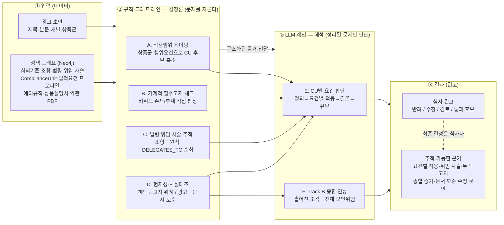
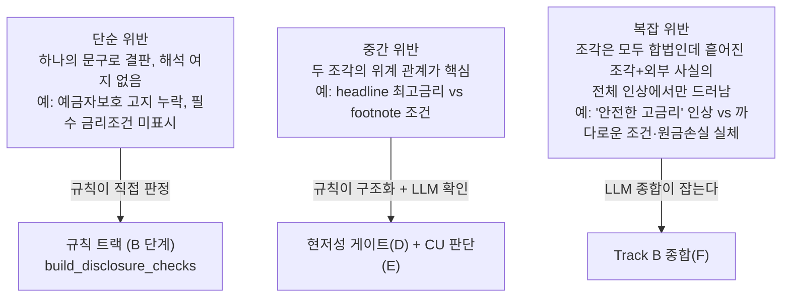
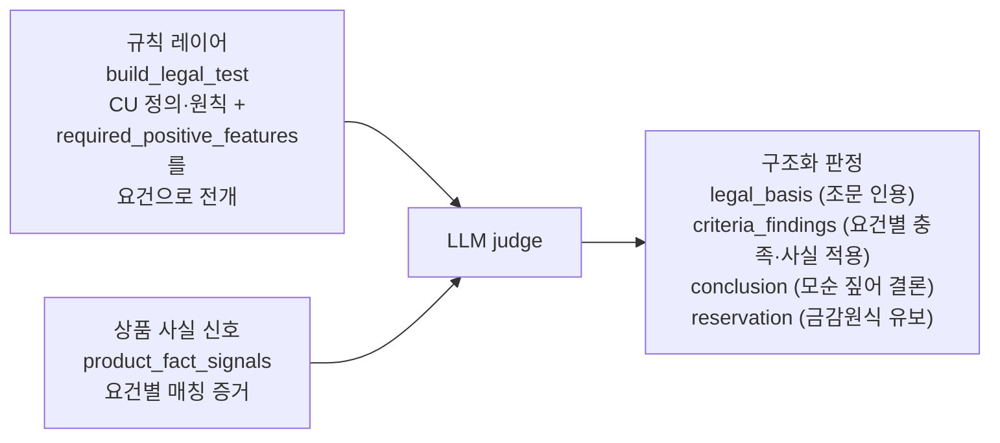
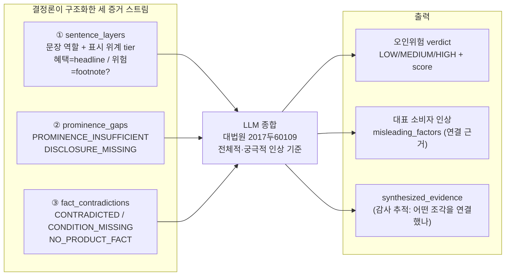
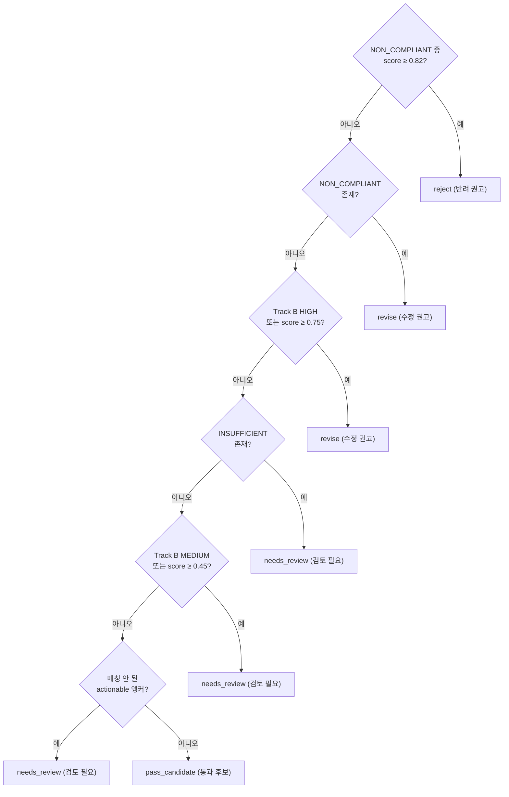

# GraphCompliance 추론 아키텍처

> JB금융그룹 준법 심사 관점의 광고 심사 추론 엔진.
> 핵심 명제: **규칙·그래프(결정론)가 문제를 자르고, LLM(해석)이 정리된 문제만 판단한다.**
> 결과는 재현 가능(같은 입력 → 같은 판정)하고 감사 가능(모든 근거가 조문으로 추적)하다.

이 문서는 실제 파이프라인(`workflow.py`의 `review_events`)과 라우팅(`router.py`의
`build_output`)에 충실하게 작성되었다. 다이어그램은 GitHub에서 바로 렌더되는 Mermaid다.

---

## 1. 한눈에 보기 — 데이터 → 과정 → 결과

규칙 트랙은 verdict를 **올릴 수만 있고(escalate-only)** 내리지 못한다. LLM이 못 잡은
누락도 결정론적으로 잡되, LLM이 잡은 위반을 규칙이 낮추지는 않는다.

---

## 2. 왜 이렇게 나누나 — 위반 복잡도 ↔ 담당 엔진

위반은 한 종류가 아니다. 복잡도에 따라 누가 잡는 게 옳은지가 달라진다.

| 복잡도 | 무엇이 핵심인가 | 담당 |
|--------|----------------|------|
| 단순 | 필수 기재사항의 존재/부재 | 규칙 (결정론) — 빠짐없이 |
| 중간 | 두 조각 사이의 표시 위계 | 규칙이 구조화 → LLM이 판단 |
| 복잡 | 흩어진 조각 + 외부 사실의 전체 인상 간극 | LLM 종합 — 깊이 있게 |

이 분업의 이유:

- 규칙·그래프 레인은 **재현 가능하고 감사 가능**하다. 같은 입력이면 같은 판정,
  근거는 조문으로 추적된다.
- 기계적 위반(필수고지 누락)을 LLM에 맡기면 **비결정성**(같은 입력 다른 답)과
  **감사 불가**(규칙 대신 그럴듯한 말)가 생긴다 → 규칙이 직접 판정한다.
- LLM 레인은 **맥락·종합이 필요한 해석**만 맡는다. 규칙이 후보를 자르고 증거를
  구조화해 주므로, LLM은 정리된 문제만 본다.

---

## 3. 실제 파이프라인 단계 (`workflow.py · review_events`)

각 단계는 스트리밍 이벤트(`step_started`/`step_completed`)로 프론트에 전달된다.
괄호 안은 결정론(규칙·그래프)인지 해석(LLM)인지 표시.

```mermaid
flowchart TB
  P0["Policy alignment check<br/>(그래프) 정책 정렬 그래프 준비 확인"]
  P1["Hierarchical context extraction<br/>(LLM) ContextFrame·SentenceUnit·Claim·Qualifier 추출"]
  P2["Policy context retrieval<br/>(그래프) 승인된 PolicyHypernym·Premise·Fragment 검색"]
  P3["Policy normalization<br/>(LLM→그래프) claim/anchor를 승인된 hypernym id로 매핑<br/>+ qualifier→행위요건 feature 부착 (규칙)"]
  P4["Product disclosure context<br/>(규칙) 상품 메타·필수고지 힌트 해석"]
  P5["Product fact graph<br/>(LLM+PDF) 상품설명서에서 ProductFact 추출, 광고 ClaimFact 대조"]
  P6["Prominence disclosure gate<br/>(규칙) 고지 존재·표시 현저성을 혜택 대비 비교"]
  P7["Track B overall impression<br/>(LLM) 전체적·궁극적 인상 종합 → 복잡 위반"]
  P8["CU candidate retrieval<br/>(그래프) hypernym 겹침·CU 임베딩으로 후보 검색"]
  P9["Cross-encoder CU rerank<br/>(선택) pairwise 교차 인코더 재정렬"]
  P10["LLM CU rerank<br/>(LLM) 최종 CUPlan 확정"]
  P11["Policy evidence chains<br/>(그래프) LegalBasis·Disclosure·Exception 사슬 순회"]
  P12["Evidence window build<br/>(그래프) CU별 좁은 증거 창 구성"]
  P13["LLM judgment<br/>(LLM) 증거 창만 보고 CU별 정의→요건→결론→유보 판단"]
  P14["Exception override<br/>(그래프+LLM) NON_COMPLIANT만 예외 폐포 검색 후 완화 여부 판단"]
  P15["Neo4j persistence<br/>리뷰 그래프 영속화"]
  P16["Revision suggestions<br/>(LLM) 위험 앵커에 수정 문안 생성"]
  P17["Routing<br/>(규칙) 유효 판정·Track B·진단 종합 → final_verdict"]

  P0 --> P1 --> P2 --> P3 --> P4 --> P5 --> P6 --> P7 --> P8 --> P9 --> P10 --> P11 --> P12 --> P13 --> P14 --> P15 --> P16 --> P17
```

흐름의 큰 줄기:

1. **추출**(P1): 광고를 문장 단위로 쪼개 역할·위계·주장·한정어를 구조화.
2. **정규화·게이팅**(P2–P4, P8–P10): 그래프가 관련 심의기준(CU)만 남기고
   무관 조항을 배제. LLM은 후보 재정렬만 한다.
3. **사실 대조·현저성**(P5–P6): 광고 주장을 상품설명서 사실과 대조하고,
   혜택 대비 고지 위계를 진단. 모두 결정론.
4. **해석**(P7, P13): LLM이 정리된 문제만 본다 — CU별 요건 판단(P13)과
   전체 인상 종합(P7).
5. **예외·라우팅**(P14, P17): 예외 폐포로 완화 가능 여부를 보고, 규칙이
   최종 권고를 집계.

---

## 4. CU별 요건 판단 — 금감원 회답 형식 (`judge.py`)

LLM 판단은 자유서술이 아니라 **법령해석 회답** 구조를 강제한다.

- `legal_basis` — 정의·근거 조문 인용.
- `criteria_findings` — `required_positive_features`를 요건으로 펼치고,
  충족/미충족과 적용된 사실을 1:1로 적는다. **미충족 요건도 빠짐없이** 기재.
- `conclusion` — 상품 사실 모순을 엮어 결론.
- `reservation` — 단정 대신 금감원식 유보 표현.

규칙이 "어떤 요건을 봐야 하는지"를 정해 주므로 LLM은 그 요건 목록 위에서만 판단한다.

---

## 5. Track B 복잡 위반 종합 (`overall_impression.py`)

복잡 위반은 "개별 조각은 모두 합법인데, 흩어진 조각 + 외부 사실을 종합한 전체
인상에서만 드러나는 위반"이다. 규칙이 세 증거 스트림을 구조화해 LLM에 넘긴다.

예: `'안전한 고금리'` 인상(친근한 상품명 + headline 최고금리 강조)과
`'조건 까다롭고 원금손실 가능'` 실체(footnote 예금자보호 미해당 + 문서상 변동금리)
사이의 간극이 오인위험이다. 개별 문구는 모두 정직하지만 종합 인상이 다르다.

`misleading_factors`에는 "어떤 조각들을 어떻게 연결했는지"를 구체적으로 적고,
`synthesized_evidence`로 그 연결 근거를 그대로 보존해 감사 가능하게 한다.

---

## 6. 라우팅 — 최종 권고 집계 (`router.py · build_output`)

규칙이 LLM 판정과 Track B, 진단을 모아 `final_verdict`를 정한다. 우선순위는 위에서부터.

추가로 `detected_issues`에는 LLM 위반(NON_COMPLIANT/INSUFFICIENT)뿐 아니라
Track B 오인위험과 **현저성 진단**(`PROMINENCE_INSUFFICIENT`·`DISCLOSURE_MISSING`)이
함께 담긴다. 즉 현저성·필수고지 신호는 이슈로는 표면화되지만, `final_verdict`를
직접 올리는 결정론 트랙으로는 아직 합류하지 않는다(향후 `rule_judgment.py`의
escalate-only 합류 대상).

> 용어: AI는 **권고형**(반려 권고/수정 권고/검토 필요/통과 후보)을 낸다.
> 최종 **확정형** 결정(승인/보완요청/반려)은 심사자가 내린다.

---

## 7. 설계 원칙 요약

- **결정론 우선, 해석은 그 위에.** 기계적으로 판정 가능한 것은 규칙이, 맥락·종합이
  필요한 것만 LLM이.
- **escalate-only 융합.** 규칙은 verdict를 올릴 수만 있다.
- **모든 근거는 추적 가능.** 조문 인용, 법령 위임 사슬, 요건별 적용, 종합 증거,
  문서 모순까지 산출물에 남긴다 — 금감원 회답처럼 설명 가능하게.
- **그래프가 적용범위를 결정한다.** 무관 조항 배제와 근거 사슬 추적은 온톨로지
  기반 그래프 순회로 한다(추측이 아니라).

---

### 관련 코드

| 영역 | 파일 |
|------|------|
| 파이프라인 오케스트레이션 | `workflow.py` (`review_events`) |
| 라우팅·최종 권고 집계 | `router.py` (`build_output`) |
| CU별 요건 판단 (회답 형식) | `judge.py` |
| Track B 종합 인상 | `overall_impression.py` |
| 현저성·필수고지 게이트 | `prominence.py` |
| 상품 사실 대조 | `product_facts.py` |
| 결정론 규칙 판정 (대기 중) | `rule_judgment.py` |
